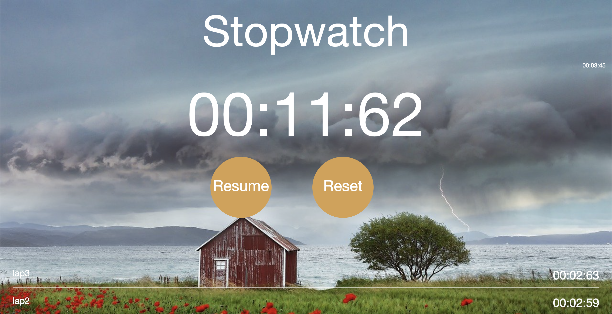

⏱️ Stop-Watch
A simple and responsive stopwatch application built with HTML, CSS, and JavaScript. Ideal for timing events, workouts, or any activity requiring precise time tracking.

🔧 Features
Start, Pause, and Reset functionalities

Clean and intuitive user interface

Responsive design compatible with desktops and mobile devices

Real-time time display with millisecond precision

🛠️ Tech Stack
HTML5

CSS3

JavaScript (Vanilla)

🚀 Getting Started
1. Clone the Repository
git clone https://github.com/luckaty/Stop-watch.git
cd Stop-watch
2. Open in Browser
Open the index.html file in your preferred web browser:

Double-click index.html
or
Right-click index.html and select "Open with" followed by your browser choice

📁 Project Structure

Stop-watch/
├── index.html       # Main HTML file
├── stying.css       # Stylesheet for styling the stopwatch
└── stopwatch.js     # JavaScript functionality for stopwatch operations
Note: Ensure that all files are in the same directory to maintain proper linking between HTML, CSS, and JavaScript files.

📸 Screenshot

📜 License
This project is licensed under the MIT License. Feel free to use, modify, and distribute it as per the license terms.
